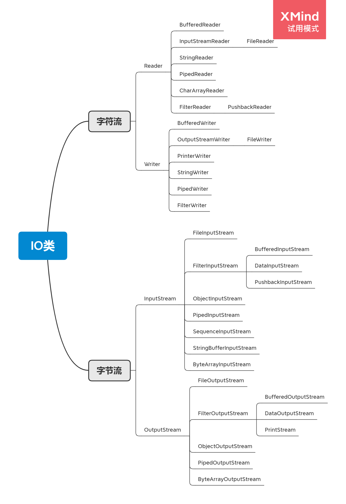

# Java IO

IO类库



## 1. JAVA IO的类型

从处理流的类型来看，Java IO 分为

1. **字节流**  InputStream， OutputStream
2.  **字符流** Reader， Writer

主要区别是：字节流按 8 位传输以字节为单位输入输出数据，字符流按 16 位传输以字符为单位输入输出数据。

## 2. 基本用法

**字节流**

实际开发中，需要根据不同的媒介类型选择相对应的子类进行处理。

- 写文件

```java
public static void writeByteToFile() throws IOException {
    String strs = new String("A text would write to file");
    byte[] byteArray = strs.getBytes();
    File file = new File("test.txt");
    
    // 因为使用字节流写媒介，所以对应的是 OutputStream
    // 因为媒介对象是文件，所以用到的子类是 FileOutputStream
    OutputStream os = new FileOutputStream(file);
    os.write(byteArray);
    os.close();
}
```

- 读文件

```java
public static void readByteFromFile() throws IOException {
    File file = new File("test.txt");
    byte[] byteArray = new byte[(int)file.length()];
    
    //因为用字节流读媒介，所以对应的是 InputStream
    //因为媒介是文件，所以对应的子类是 FileInputStream
    InputStream is = new FileInputStream(file);
    int size = is.read(byteArray);
    System.out.println("size:" + size + "content:" + new String(byteArray));
    is.close();
}
```

### copyfile demo

```java
package com.chenhao.io.byteIO;

import java.io.File;
import java.io.FileInputStream;
import java.io.FileNotFoundException;
import java.io.FileOutputStream;
import java.io.IOException;
import java.io.InputStream;
import java.io.OutputStream;

/**
 * @author ChenHao
 *
 */
public class CopyFileDemo {

    /**
     * @param args
     * @throws FileNotFoundException 
     */
    public static void main(String[] args) {
        String src ="E:/xp/test";
        String dest="e:/xp/test/4.jpg";
        try {
            copyFile(src,dest);
        } catch (FileNotFoundException e) {
            e.printStackTrace();
            System.out.println("文件不存在");
        } catch (IOException e) {
            e.printStackTrace();
            System.out.println("拷贝文件失败|关闭流失败");
        }
    }
    /**
     * 文件的拷贝
     * @param  源文件路径
     * @param  目录文件路径
     * @throws FileNotFoundException,IOException
     * @return 
     */
    public static void copyFile(String srcPath,String destPath) throws FileNotFoundException,IOException {
        //1、建立联系 源(存在且为文件) +目的地(文件可以不存在)  
        File src =new File(srcPath);
        File dest =new File(destPath);
        if(! src.isFile()){ //不是文件或者为null
            System.out.println("只能拷贝文件");
            throw new IOException("只能拷贝文件");
        }
        //2、选择流
        InputStream is =new FileInputStream(src);
        OutputStream os =new FileOutputStream(dest);
        //3、文件拷贝   循环+读取+写出
        byte[] flush =new byte[1024];
        int len =0;
        //读取
        while(-1!=(len=is.read(flush))){
            //写出
            os.write(flush, 0, len);
        }
        os.flush(); //强制刷出
        
        //关闭流
        os.close();
        is.close();
    }

}
```

**字符流**

字符流传输的最小数据单位为 `char`。

- 写文件

```java
public static void writeCharToFile() throws IOException {
    String strs = new String("A text would write to file");
    File file = new File("test.txt");
    
    // 因为使用字符流写媒介，所以对应的是 Writer
    // 因为媒介对象是文件，所以用到的子类是 FileWriter
    Writer writer = new FileWriter(file);
    writer.write(byteArray);
    writer.close();
}
```

- 读文件

```java
public static void readByteFromFile() throws IOException {
    File file = new File("test.txt");
    
    //因为用字符流读媒介，所以对应的是 Reader
    //因为媒介是文件，所以对应的子类是 FileReader
    Reader reader= new FileReader( file);
    char [] byteArray= new char[( int) file.length()];
    int size= reader.read( byteArray);
    System. out.println( "size:" + size + ";content:" + new String(byteArray));
    reader.close();
}
```

使用`Reader`，数据源虽然是字节，但我们读入的数据都是`char`类型的字符，原因是`Reader`内部把读入的`byte`做了解码，转换成了`char`。使用`InputStream`，我们读入的数据和原始二进制数据一模一样，是`byte[]`数组，但是我们可以自己把二进制`byte[]`数组按照某种编码转换为字符串。究竟使用`Reader`还是`InputStream`，要取决于具体的使用场景。如果数据源不是文本，就只能使用`InputStream`，如果数据源是文本，使用Reader更方便一些。`Writer`和`OutputStream`是类似的。

### 小结

IO流是一种流式的数据输入/输出模型：

- 二进制数据以`byte`为最小单位在`InputStream`/`OutputStream`中单向流动；
- 字符数据以`char`为最小单位在`Reader`/`Writer`中单向流动。

Java标准库的`java.io`包提供了同步IO功能：

- 字节流接口：`InputStream`/`OutputStream`；
- 字符流接口：`Reader`/`Writer`。

## 3. File对象

Java 的标准库 java.io 提供了 File 对象来操作文件和目录。

要构建一个 File 对象，需要传入文件路径。

`File file = new File("path");`

File对象有3种形式表示的路径，一种是`getPath()`，返回构造方法传入的路径，一种是`getAbsolutePath()`，返回绝对路径，一种是`getCanonicalPath`，它和绝对路径类似，但是返回的是规范路径。
